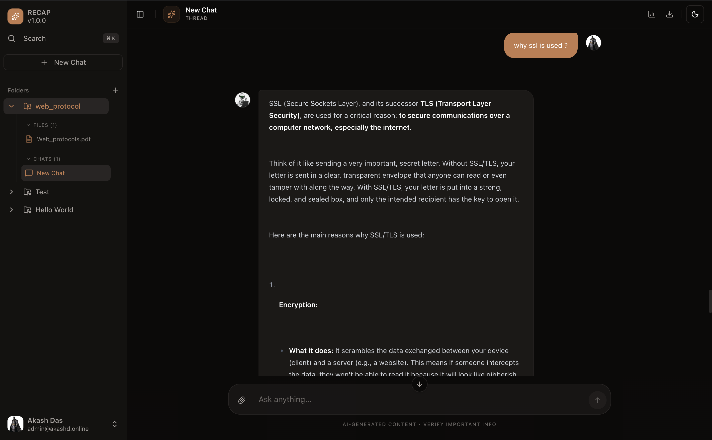
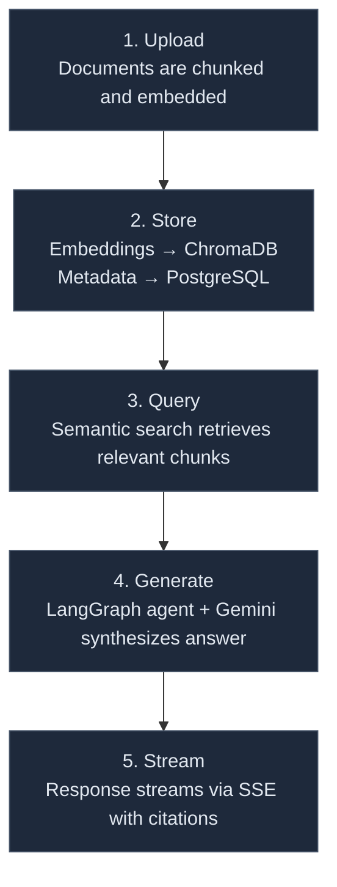

# Recap

AI-powered document search with citations. Upload documents, chat with AI, get accurate answers backed by your content.

<div align="center">
  
</div>

## Features

<div align="center">

| Feature                     | Description                                                                 |
|-----------------------------|-----------------------------------------------------------------------------|
| **Context Isolation**       | Organize documents into folders for zero-noise retrieval                    |
| **Cited Answers**           | Every response links directly to source content                             |
| **Real-time Collaboration** | Share folders with your team                                                |
| **Smart Search**            | Vector-powered semantic search with LangGraph agents                        |

</div>

## Stack

<div align="center">

| Category    | Technologies                                                                 |
|-------------|------------------------------------------------------------------------------|
| **Backend** | FastAPI • Python 3.12 • LangGraph • ChromaDB • PostgreSQL • Prisma           |
| **Frontend**| Next.js 15 • React • TypeScript • Tailwind CSS • shadcn/ui                  |
| **AI**      | Google Gemini 1.5 Flash                                                     |

</div>

## How It Works

<div align="center">



</div>

## Quick Start

### Backend

```bash
git clone https://github.com/dasakash26/Recap.git
cd Recap/backend

# Install dependencies
uv sync

# Setup environment
cp .env.example .env
# Edit .env with your credentials
```

```bash
# Generate Prisma client and run migrations
uv run prisma generate
uv run prisma migrate deploy

# Start server
uv run uvicorn main:app --reload
```

Backend runs at [http://localhost:8000](http://localhost:8000) • API docs at `/docs`

</div>

### Frontend

```bash
cd ../frontend

# Install dependencies
pnpm install

# Setup environment
cp .env.example .env.local
# Edit .env.local with backend URL
```

**`.env.local` file example:**

```bash
# Start dev server
pnpm dev
```

Frontend runs at [http://localhost:3000](http://localhost:3000)

## License

MIT © 2026 Akash Das
